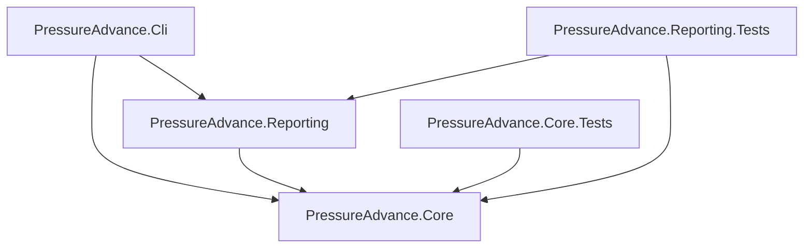

# Architecture

## Runtime data flow

```mermaid
flowchart LR
    Scenario[Motion scenario] --> Motion[MotionProfile]
    Motion --> State[velocity v(t) and acceleration a(t)]
    Geometry[ExtrusionGeometry] --> Demand[ExtrusionDemandCalculator]
    State --> Demand
    Demand --> Requested[Requested flow Qr and derivative dQr/dt]
    Requested --> FF[Feed-forward controller]
    FF --> Drive[Drive command Qd]
    Drive --> Plant[FirstOrderExtrusionPlant]
    Plant --> Pressure[Nozzle pressure P]
    Pressure --> Actual[Actual flow Qa]
    Requested --> Sample[SimulationSample]
    Drive --> Sample
    Pressure --> Sample
    Actual --> Sample
    Sample --> Metrics[Metrics calculators]
    Sample --> Reporting[SVG / CSV / JSON]
```

## Dependency boundaries



## Suggested Core folders

```text
PressureAdvance.Core/
├── Control/
│   ├── IExtrusionFeedForward.cs
│   ├── NoCompensationFeedForward.cs
│   ├── PressureAdvanceFeedForward.cs
│   ├── DriveCommand.cs
│   └── DriveFlowPolicy.cs
├── Extrusion/
│   ├── ExtrusionGeometry.cs
│   ├── ExtrusionDemand.cs
│   └── ExtrusionDemandCalculator.cs
├── Motion/
│   ├── IMotionSegment.cs
│   ├── MotionState.cs
│   ├── ConstantVelocitySegment.cs
│   ├── ConstantAccelerationSegment.cs
│   ├── MotionProfile.cs
│   ├── MotionTransition.cs
│   └── BuiltInScenarios.cs
├── Plant/
│   ├── IExtrusionPlant.cs
│   ├── PlantParameters.cs
│   ├── PlantState.cs
│   └── FirstOrderExtrusionPlant.cs
├── Simulation/
│   ├── SimulationOptions.cs
│   ├── SimulationSample.cs
│   ├── SimulationResult.cs
│   └── SimulationEngine.cs
├── Metrics/
│   ├── RunMetrics.cs
│   ├── RunMetricsCalculator.cs
│   ├── SettlingOptions.cs
│   ├── TransitionSettlingResult.cs
│   └── SettlingAnalyzer.cs
└── Sweeps/
    ├── KSweepOptions.cs
    ├── KSweepPoint.cs
    ├── KSweepResult.cs
    └── KSweepRunner.cs
```

## Reporting folders

```text
PressureAdvance.Reporting/
├── Csv/
│   └── SimulationCsvWriter.cs
├── Json/
│   ├── JsonReportWriter.cs
│   └── ReportJsonContext.cs
└── Svg/
    ├── SvgChart.cs
    ├── SvgSeries.cs
    ├── SvgAxis.cs
    ├── SvgWriter.cs
    └── StandardCharts.cs
```

A source-generated `System.Text.Json` context is encouraged if it stays simple and improves future NativeAOT compatibility.
