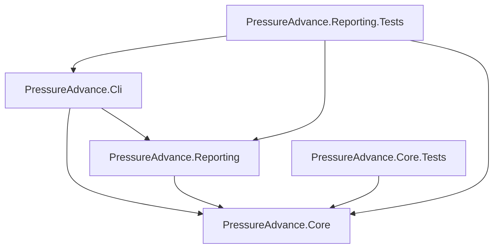

# Architecture

## Runtime data flow

```mermaid
flowchart LR
    Scenario[Motion scenario] --> Motion[MotionProfile]
    Motion --> State[velocity v(t) and acceleration a(t)]
    Geometry[ExtrusionGeometry] --> Demand[ExtrusionDemandCalculator]
    State --> Demand
    Demand --> Requested[Requested flow Qr and derivative dQr/dt]
    Requested --> FF[Feed-forward controller]
    FF --> Drive[Drive command Qd]
    Drive --> Plant[FirstOrderExtrusionPlant]
    Plant --> Pressure[Nozzle pressure P]
    Pressure --> Actual[Actual flow Qa]
    Requested --> Sample[SimulationSample]
    Drive --> Sample
    Pressure --> Sample
    Actual --> Sample
    Sample --> Metrics[Metrics calculators]
    Sample --> Reporting[SVG / CSV / JSON]
```

## Dependency boundaries



