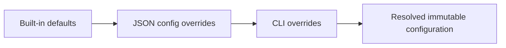

# CLI Contract

The CLI is an educational experiment runner, not a shell framework.

## Commands

### list-scenarios

```powershell
PressureAdvance.Cli list-scenarios
```

Print scenario name and short purpose.

### simulate

```powershell
PressureAdvance.Cli simulate [options]
```

Runs one scenario with one K.

Expected options:

- `--scenario <name>`;
- `--config <path>`;
- `--output <path>`;
- `--k <seconds>`;
- `--tau <seconds>`;
- `--gain <value>`;
- `--dt <seconds>`;
- `--layer-height <mm>`;
- `--line-width <mm>`;
- `--drive-policy clamp|allow-negative`.

### compare

```powershell
PressureAdvance.Cli compare --scenario corner --k 0.04
```

Runs no-compensation/K=0 and selected K. The compared runs must share exactly the same motion profile, geometry, plant, dt, and initial-pressure configuration.

### sweep

```powershell
PressureAdvance.Cli sweep --k-start 0 --k-end 0.10 --k-step 0.005
```

Additional options:

- `--k-start`;
- `--k-end`;
- `--k-step`.

## Configuration precedence



Resolve all configuration before starting simulation. Write the resolved values to `run.json`.

## Exit codes

Recommended:

- 0: success;
- 2: invalid command/configuration;
- 3: I/O/reporting failure;
- 4: unexpected simulation failure.

Exact values may differ, but tests and help text must be consistent.

## Console summary

Print concise human-readable metrics after each run. Do not hard-code example results in source documentation.

A compare command should report percentage IAFE reduction only when baseline IAFE is non-zero:

\[
Reduction=100\left(1-\frac{IAFE_{selected}}{IAFE_{baseline}}\right)
\]

If selected K is worse, allow the percentage to be negative rather than relabeling it as an improvement.
