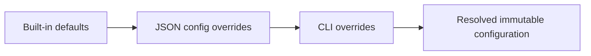

# CLI Contract

The CLI is an experiment runner with four commands.

## Commands

### list-scenarios

```powershell
PressureAdvance.Cli list-scenarios
```

Prints each built-in scenario name and purpose.

### simulate

```powershell
PressureAdvance.Cli simulate [options]
```

Runs one scenario and one K value, then writes the standard run artifacts.

### compare

```powershell
PressureAdvance.Cli compare --scenario corner --k 0.04
```

Runs K=0 and the selected K with exactly the same motion profile, geometry, plant, timestep, and initial-pressure configuration. It writes both individual runs and a comparison chart.

### sweep

```powershell
PressureAdvance.Cli sweep --k-start 0 --k-end 0.10 --k-step 0.005
```

Runs an inclusive deterministic K sweep and reports the grid point with minimum IAFE. Ties within `1e-12` select the lower K.

## Options

- `--scenario <name>`;
- `--config <path>`;
- `--output <path>`;
- `--k <seconds>`;
- `--tau <seconds>`;
- `--gain <value>`;
- `--dt <seconds>`;
- `--layer-height <mm>`;
- `--line-width <mm>`;
- `--drive-policy clamp|allow-negative`;
- `--k-start <seconds>`;
- `--k-end <seconds>`;
- `--k-step <seconds>`.

`--help`, `-h`, `help`, or no arguments print usage. K is always labeled in seconds.

## Configuration precedence



All configuration is resolved and validated before simulation. Resolved values are recorded in `run.json`.

## Exit codes

- 0: success;
- 2: invalid command or configuration;
- 3: I/O or reporting failure;
- 4: unexpected simulation failure.

## Console summary

Run summaries include human-readable IAFE, peak under-flow, peak over-flow, RMSE, and clamp count with explicit units. A comparison prints:

\[
Reduction=100\left(1-\frac{IAFE_{selected}}{IAFE_{baseline}}\right)
\]

The reduction is printed only when baseline IAFE is non-zero. A worse selected K produces a negative percentage rather than being labeled as an improvement. The CLI warns when `dt > tau/10` because explicit Euler accuracy may be poor.
