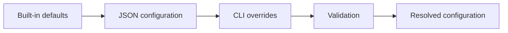

# Configuration Contract

## Principle

Configuration is resolved once before simulation begins and converted into immutable domain options. Simulation code must not read environment variables, command-line arguments, or JSON directly.

Resolution precedence:



## Top-level JSON shape

The examples in `examples/` are the expected authoring format. The implementation may use DTOs distinct from domain records.

### scenario

String built-in scenario name. Required unless a future custom motion-profile schema is explicitly added.

### geometry

- `layerHeightMm`: positive finite double.
- `extrusionWidthMm`: positive finite double.

### plant

- `timeConstantSeconds`: positive finite double.
- `pressureGain`: positive finite double.

### simulation

- `timeStepSeconds`: positive finite double.
- `initialPressure`: either the string `steady-state` or a finite numeric pressure value if the DTO design supports a tagged representation cleanly.

If mixed string/number JSON complicates source generation, prefer an explicit object:

```json
{
  "initialPressure": {
    "mode": "steady-state"
  }
}
```

or:

```json
{
  "initialPressure": {
    "mode": "explicit",
    "value": 0.0
  }
}
```

Codex may normalize the provided examples to the cleaner representation, but must update all examples and docs consistently.

### pressureAdvance

- `kSeconds`: finite, non-negative double for a single simulation.
- `driveFlowPolicy`: `ClampToZero` or `AllowNegative`, case-insensitive at CLI/JSON boundary if convenient.

### settling

- `relativeTolerance`: finite non-negative fraction; default `0.02`.
- `absoluteToleranceFloorMm3PerSecond`: finite non-negative value; default `0.02`.
- `holdSeconds`: finite positive duration; default `0.05`.

### sweep

Used by sweep command:

- `startKSeconds`: finite non-negative value;
- `endKSeconds`: finite value >= start;
- `stepKSeconds`: finite positive value.

## CLI override rules

A CLI option overrides only its corresponding field. It must not reset unrelated values back to defaults.

Example: when JSON specifies `tau=0.08`, `width=0.50`, and CLI supplies `--k 0.03`, the resolved configuration keeps tau 0.08 and width 0.50.

## Serialization names

Use stable camelCase JSON field names. Renaming internal C# types must not silently change report/config contracts.

## Validation output

Prefer messages that identify both field and rejected value, for example:

```text
Invalid value for --tau: 0. Time constant must be greater than zero seconds.
```

Avoid stack traces for ordinary user configuration errors.
