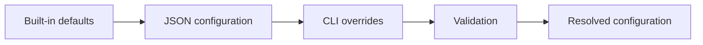

# Configuration Contract

## Resolution

Configuration is resolved once before simulation and converted into immutable domain options. Simulation code does not read environment variables, command-line arguments, or JSON.

Precedence is CLI override, then JSON configuration, then built-in default. A CLI option overrides only its corresponding field and does not reset unrelated JSON values.

## JSON shape

The files in `examples/` use the accepted authoring format. The CLI deserializes JSON DTOs and then constructs validated core records.

### scenario

A required built-in scenario name: `acceleration`, `deceleration`, `trapezoid`, `corner`, or `multi-change`.

### geometry

- `layerHeightMm`: positive finite double;
- `extrusionWidthMm`: positive finite double.

### plant

- `timeConstantSeconds`: positive finite double;
- `pressureGain`: positive finite double.

### simulation

- `timeStepSeconds`: positive finite double;
- `initialPressure`: the string `steady-state` or a finite numeric pressure value.

### pressureAdvance

- `kSeconds`: finite non-negative double in seconds;
- `driveFlowPolicy`: `ClampToZero` or `AllowNegative`, parsed case-insensitively.

### settling

- `relativeTolerance`: finite non-negative fraction, default `0.02`;
- `absoluteToleranceFloorMm3PerSecond`: finite non-negative value, default `0.02`;
- `holdSeconds`: finite positive duration, default `0.05`.

### sweep

- `startKSeconds`: finite non-negative value;
- `endKSeconds`: finite value greater than or equal to the start;
- `stepKSeconds`: finite positive value.

## Override example

When JSON specifies `tau = 0.08`, width `0.50`, and the CLI supplies `--k 0.03`, the resolved configuration keeps tau `0.08` and width `0.50` while replacing only K.

## Serialization and validation

Configuration and report field names are stable camelCase names. Machine-readable numeric output uses invariant decimal notation. Ordinary configuration errors identify the rejected option or field, return a non-zero exit code, and do not print a stack trace.
