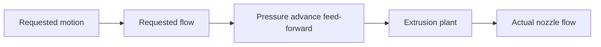
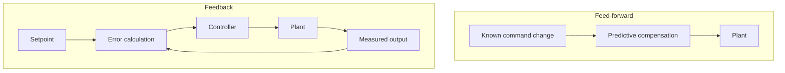

# Pressure Advance as Feed-Forward

## Control interpretation

Pressure advance in this repository is feed-forward compensation. It does not observe `ActualFlow` and it does not compute an error correction.

There is deliberately no return arrow from actual flow to the controller.

## Contrast with feedback

A PID controller reacts to measured/setpoint error. Pressure advance uses known requested-flow dynamics to pre-shape the actuator command.

## Under-, near-, and over-compensation

With an ideal first-order plant:

- `K < tau`: residual lag remains;
- `K ≈ tau`: feed-forward approximately cancels lag;
- `K > tau`: the command is over-shaped and can create opposite-sign transients.

The default K sweep should make this visible.

## Clamp implications

Strong deceleration may make:

\[
Q_r+K\dot Q_r<0
\]

With `ClampToZero`, ideal cancellation is no longer possible through that interval because the actuator command saturates.

This is useful, not a defect: it demonstrates that model inversion is limited by actuator capability.

The simulator must report clamp count and preserve raw drive flow in samples.

`AllowNegative` is an abstract experiment mode. It does not claim that a real extruder instantly realizes negative volumetric nozzle flow.

## Model mismatch

The MVP intentionally uses a plant that can be approximately cancelled by one feed-forward coefficient. Future extensions may use cascaded or nonlinear dynamics to demonstrate that feed-forward quality depends on model accuracy.
